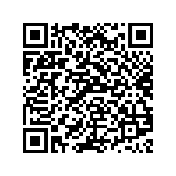

# AlpenPreisGrenze - Stop-Österreich-Aufschlag-App

## 🏠 Die Mission von AlpenPreisGrenze

Willkommen bei Ihrer MStop-Österreich-Aufschlag-App AlpenPreisGrenze! Wir glauben daran, dass jeder Österreicher das Recht auf faire und transparente Preise im Einzelhandel hat. Unser Ziel ist es, die Preise in Österreich mit den Deutschen Preisen anzugleichen!

## 🔍 Österreich-Aufschlag schnell und einfach ermitteln

Duch eine Scan des Produktbarcodes mit der AlpenPreisGrenze App bekommt der Benutzer sofort den 
Österreich-Aufschlag angezeigt. Falls vorhanden auch die Höhe der "Shrinkflation" (gleicher Preis, weniger Inhalt) und/oder der
"Sizefuscation" (handelsunübliche Packungsgrößen die der Preisverschleierung dienen).

## 🚀 Österreich-Aufschlag teilen

User können ihre entdeckten Österreich-Aufschläge (aber auch die von anderen Users) schnell und einfach aus der App heraus in den Sozialen Medien teilen. Auch gibt es die Möglichkeit vorgefertigte E-Mails an den Kundendienst des entsprechenden Händlers zu senden! Darin wird auf die gefundene Preisdifferenz aufmerksam gemacht und um Erklärung ersucht wie es dazu kommt! 

## ✊ Gemeinsam Druck auf den Handel ausüben

Das Ziel ist es in einer koordinierten, gemeinschaftlichen Aktion die sozialen Netzwerke zu fluten und die E-Mail-Postfächer der Handelskonzerne zum Glühen zu bringen! Aktionen wie die Verleihung des "goldenen Häufchens" in dem jede Woche der Händler mit dem grössten ermittelten Österreich-Aufschlag "geehrt" wird verstärken den öffentlichen Druck noch weiter! 

## 🌟 Vorteile

- **Zentrale Sammlung aktueller Preisdifferenzen**: Erstellt von echten Kunden
- **Community-basiert**: Von Kunden für Kunden - keine kommerziellen Interessen
- **Aktuelle Informationen**: Immer auf dem neuesten Stand über aktuelle Preisunterschiede
- **Kostenlos & unabhängig**: Keine versteckten Kosten oder Gebühren
- **Datenschutz**: Ihre Daten gehören Ihnen - wir respektieren Ihre Privatsphäere

## 📱 Installation

Scannen sie den QR-Code um direkt die aktuellse release zu installieren:

Laden Sie die neueste Version der App aus den [Releases](https://github.com/bobanmilano/alpenpreisgrenze/releases/latest) herunter.

1.  Laden Sie die Datei `app-release.apk` herunter.
2.  Öffnen Sie die Datei auf Ihrem Android-Gerät.
3.  Folgen Sie den Anweisungen zur Installation. Falls eine Sicherheitsmeldung erscheint, tippen Sie auf "Einstellungen" und aktivieren Sie "Unbekannte Quellen" oder tippen Sie direkt auf installieren".
4.  Starten Sie die App.

### Systemanforderungen
- Android 7.0 oder höher
- Internetverbindung für Bewertungen und Daten

## 🤲 Gemeinsam für einen fairen Handel!

Treten Sie unserer Community bei und tragen Sie dazu bei, den Einzelhandel transparenter und fairer zu machen.

## 💬 Feedback & Kontakt

Haben Sie Fragen oder Feedback? Wir freuen uns über Ihre Rückmeldung! Kontaktieren Sie uns über die App-Einstellungen oder schreiben Sie uns direkt eine E-Mail-Nachricht.

## 🔐 Datenschutz

Wir legen großen Wert auf Ihren Datenschutz. Ihre persönlichen Daten werden vertraulich behandelt und nicht an Dritte weitergegeben.

## 📄 Lizenz

Diese App ist urheberrechtlich geschützt. Alle Rechte vorbehalten.

## 🚀 Entwicklung

in Planung